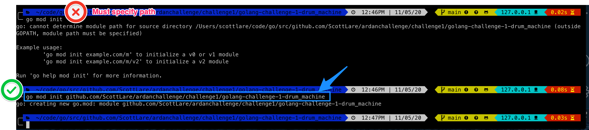

# Challenges

## Challenge 1

## Steps for creating Challenge 1 solution

| Order        | Description          |
| :-------------: |:-------------|
| 1 | <a href="#step1a">Unzip Challenge 1 file to a local subdirectory and run the test file.</a> |
| 2 | <a href="#step2a">Create your github repository.</a> |
| 3 | <a href="#step3a">Whoops - first problem encountered - What to do?.</a> |
| 4 | <a href="#step4a">Answer - I forgot to initialize go modules.</a> |
| 5 | <a href="#step5a">We are now setup and ready to go.</a> |
| 6 | <a href="#step6a">Reverse Engineer.  Lets start by following the hints and making sure we can dump basic hex from a binary.READING in the binary provided file.</a> |
| 7 | <a href="#step7a">Reverse Engineer.  Lets start by READING in the binary provided file.</a> |
| 8 | <a href="#step8a">Reverse Engineer.</a> |

<a name="step1a"></a>
`

Step one is to follow the directions and after unzipping provided file and going to that subdirectory - run the 

```bash
$ go test -v
```


<a name="step2a"></a>
`

### Create a github repository

Next step is to link over to 'github' and create a Repo for this project.


Make sure to do the following from your terminal while inside your local github repository subdirectory:

```bash
$ git add .
$ git commit -m "initial test of repo"
$ git push main

```


<a name="step3a"></a>
`

### First Problem - Why is fmt not recognized?


<a name="step4a"></a>
`

### Answer - I forgot to initialize go modules.

<span style="font-size:20px;" ><b>`Tip - Reload VSCode`</b></span> &#x1F53D;

I noticed that the fmt.Println error did not go away until I closed and reloaded VSCODE!




and we are back in business:


The next step I took was to follow the directions of the provided **"Hint"** :


My thought being to create a function to reverse engineer the binary, however, I was pretty sure that the go language required a package main and an initial function main so I created that to do my test and figured that I would deal with properly handling the provided package LOAD later on.


<a name="step5a"></a>
`

### We are now setup and ready to go.

So we should now be setup and ready to go:


<a name="step6a"></a>
`
### Reverse Engineer.  Lets start by following the hints and making sure we can dump basic hex from a binary.READING in the binary provided file.


<a name="step7a"></a>
`

### Reverse Engineer.  Lets start by READING in the binary provided file.


But first, we need to grab the relative file path, since as a package this may move around, but the structure of the package should remain the same so I can be confident that the fixtures subdirectory will not change.  If it did, then in addition to a breaking change and a version uptick, it would have to be changed here in this code to reflect a directory name change or movement of the stored binary files.


Next, let's read it into a variable:


Then, the hex dump:


### Can we detect patterns?


## Challenge 2

## Challenge 3

## Challenge 4

## Challenge 5

## Challenge 6

## Challenge 7

## Challenge 8

## Challenge 9