# Building a Web Server

### Document 

| Status | Meaning  |
| :------------- | :------------- |
| :white_check_mark: | Simple Golang Program Walkthrough (Building a Web Server)|
| :footprints: | Incorporating Docker |
| :footprints: | Incorporating kubernetes |
| :mag_right: | Creating a Front-end Microservice |
| :mag_right: | Creating a Back-end Microservice |
| :mag_right: | TBD |

## Initial Steps

Step 1 is to [install golang](https://golang.org/dl/), [create a github repo](https://docs.github.com/en/free-pro-team@latest/github/getting-started-with-github/create-a-repo) and test that the github repo is working by issuing the following three commands from your local subdirectory after completing a git clone

To verify the installation.

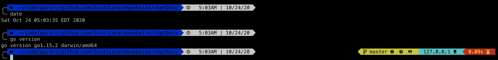

```bash
$ git clone https://github.com/ScottLare/marknsam.git 
```
```bash
$ git add .
$ git commit -m "inital push ..."
$ git push origin main
```

## Building a Web Server

Using VSCode, create the following brand new go program and save it to your current directory. When you save the file, name it "simpletest.go".

```go
package main

import (
	"log"
	"net/http"
)

// main - set up a function handler to send some HTML and CSS to a browser
func main() {
	http.HandleFunc("/", func(w http.ResponseWriter, r *http.Request) {
		w.Write([]byte(`
        <html>
        <head>
		<title>GOLANG TEST</title>
		</head>
		<style type="text/css">
        .cell-green {
            background: rgba(0,255,0,0.1);
        }
		</style>
        <body>
		<p class="cell-green">Hello World</p>
		</body>
        </html>`))
	})

	//start the webserver and listen on port 8080
	if err := http.ListenAndServe(":8080", nil); err != nil {
		log.Fatal("LisenAndServer:", err)
	}
}
```

## Run

In order to run a go program in the simplest manner:

```bash
$ go run simpletest.go
```

## Result

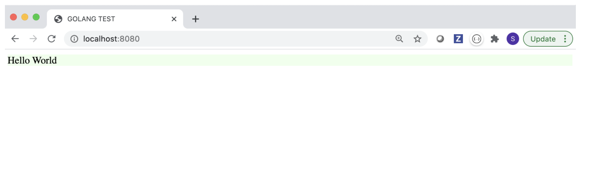


## Explanation.

```go
package main

/**
 *
 * Notes for new developer on General Required Syntax.
 * Every program must begin with the above statement "package main"
 * As well, every entry function must be named func main()
 *
 **/

/**
 *
 * Notes for new developer on IMPORT statement.
 * Go uses the import statement to pull other modules, which are called packages in go as dependencies
 * There is a large community of packages to pull in and I will go over a few of the most common later,
 * but for starters, know that there are both community packages and "standard" packages where
 * standard packages are the packages that are inherent to golang's core project and
 * they are downloaded for you during the install process as part of the "standard go library"
 * All "Import" packages are stored locally.  It the package is an external 3rd party dependency
 * then go will automatically detect that fact and perform a "go git" command to pull it down for you.
 *
 * In the example below, both packages (think separate modules that your program uses) are part of
 * the "standard go library" and you know this because there is no location specified with the Import statement.
 * For example, and I did this on purpose, the first one is called log.  The golang runtime
 * provides a rather primitive log module for writing your programs output stream (stdout or stderr) for example.

 * In an example coming up soon we will, instead of using the standard go language "log" package, "Import"
 * a more powerful, useful, commonly used and well worn package for logging for a person named "Sirupsen".
 * The "Import" statement that we will review with the more powerful logging features,
 * like exporting to multiple logs at once with one or more of them exporting to JSON format.
 * will have a format like:
 *  log "Github.com/Sirupsen/logrus"
 * Note for now that in the statement above, as a developer, you can choose to set an alias name followed by a space.
 * If the alias name "log" was not specified above, then every time you wanted to use a function from the logging package
 * you would have to type out the entire line as is illustrated in quotes above.

 * One more important note about the "Imports" statements below.  Our example "simpletest.go" program will
 * a fully functional web server.  Yup, in only a few lines of code. The key is that
 * the standard library module/package named "net/http" includes all that under the hood
 * cruft already build for us.  :-)
 *
 **/

import (
	"log"
	"net/http"
)

/**
 *
 * Notes for new developer on the func (function) named http.HandleFunc().
 * Very soon we will see another very similar function that does the same thing
 * basically as HandleFunc(), however, instead of just simply handling a function,
 * like we are doing in the below example, as unnamed anonymous function by the way, the
 * http.Handler() is an interface that defines the requirements of any function that you
 * want to write to be polymorphic and to use "compositon" in your program via an interface the
 * functionality of a "web server".  This is one of the main and I think great
 * advantages and differences between object oriented classic languages like JAVA and C# where
 * in golang:
 *      * Interfaces are implemented and the IMPLEMENTS key word is autogenerated under the covers for you
 *      * Golang does not, by design, allow for OO classic inheritance  (super cool - super powerful)
 * I will go more indepth on interfaces soon, if above seemed wierd at first, but for now,
 * I just wanted to introduce INTERFACES as they are a powerful feature in golang.

 *
 *
 **/

// main - set up a function handler to send some HTML and CSS to a browser
func main() {
	http.HandleFunc("/", func(w http.ResponseWriter, r *http.Request) {
		w.Write([]byte(`
        <html>
        <head>
		<title>GOLANG TEST</title>
		</head>
		<style type="text/css">
        .cell-green {
            background: rgba(0,255,0,0.1);
        }
		</style>
        <body>
		<p class="cell-green">Hello World</p>
		</body>
        </html>`))
	})

	/**
	 *
	 * Notes for new developer on http.ListenAndServe().
	 *
	 * This function actually launches your webserver on port 8080.  The second
	 * parameter is nil.  Go uses nil, not null.  When this second parameter is
	 * nil, it means that golang will use the "default" mux that comes pre-packaged
	 * as part of the go standard library.  If you want to install your own, more
	 * powerful MUX then this is where it would be inserted.  A popular one
	 * is the Gorrilla MUX located at "https://github.com/gorilla/mux"
	 *
	 **/

	//start the webserver and listen on port 8080
	if err := http.ListenAndServe(":8080", nil); err != nil {
		log.Fatal("LisenAndServer:", err)
	}

	/**
	 *
	 * Notes for new developer on Errors.
	 * One last thing in this example, and it trips many developers up at first
	 * and that is the way that golang handles errors.  There are no more "try/catch/finally" conditionals
	 * when you use golang.  Golang's philosophy on errors is that anytime there is possilbilty
	 * that the code that you are writing could possibly return an error, then the
	 * developer "should" and is responsible for handling that error "right there and then".
	 * At first, many new developers resist and say "that is a lot of cruft or needless template to write"
	 * but most use it enough to see real benefits and advantages including more robust code
	 * and easier code maintainability over time.
	 *
	 * Moving past the philosophy of "handling errors" in golang. An important thing to note
	 * in the above code is that golang syntax allows for two ways to write conditional "if"
	 * statements, and sometimes if you are new to the language and if a beginner programmer that
	 * has not seen these two formats then it may be worth quickly pointing out before getting a little
	 * more into the error() interface.
	 *
	 * The most common and typical form for checking for an error is using the "if" statement
	 * to check for a returned error as follows:
	 *
	 *   if err !nil {
	 *		log.Fatalf("some did not return correctly: %v", err)
	 *   }
	 *
	 *  and of course as I used above
	 *
	 *  	if err := http.ListenAndServe(":8080", nil); err != nil {
	 *		log.Fatal("LisenAndServer:", err)
	 *	}
	 *
	 * using the ; above to denote the condition is cleaner to some because it saves typing
	 * but they are the exactly the same.
	 *
	 * A few more important notes on "Errors" in golang:
	 *
	 * 	1) Functions in go can and most often do, return more than one value.  Usually, they return
	 * 	   at least 2 values, and by convention, the second, or if more return values, then the last
	 * 	   value returned is the "err" value.
	 *
	 *  2) Above, the last word, I said value and not string.  At first, you can simply think of
	 *     errors as returning strings because that is the default interface for the golang error.
	 *     However, the power of golang errors comes to life when you realize that they are any
	 *     kind of value that you want to define by extending the interface.  For now, I think
	 *     it is okay to think "broadly" as errors being string values, but remember for later
	 *     that they can be created into more complex "objects" and that is powerul.
	 *
	 *  3) For the once and only time, I used the term "objects" above and that is actually not correct terminology in golang.
	 *     Golang has what I call "almost objects", they are correctly called "Types".  However,
	 *     as mentioned before, the only thing that they do not have is the ability to inherit.
	 *     You can still write methods for the "Types" and you can pass them around in memory (minus inheritance)
	 *     similarly to JAVA or C# et. al.   So, what does the go standard error interface look like:
	 *
	 *     type error interface {
	 *    		Error() string
	 *		}
	 *
	 **/

}

```

## Incorporating Docker

### Building our go program for Docker

In the above "simpletest" example we used the golang deployment method of

#### Instruction

```go
$ go run programName
```

However, this method of running a go program does not create an executable artifact and we require that for running our program in a docker container.

So, first, we have to compile our "simpletest.go" program into a binary.

We can do this for multiple or any popular type of chip architecture or Operating system.  In this case, since I am running on a MACPRO, I will compile the source code down to the binary.  WHOOPS, common gotcha.

Actually, since I will be attempting to keep my docker container size small for faster transport as well as a smaller security surface attack area, I will choose to use an ALPINE container, which is a small linux operating system.  This means that I actually have to compile down to that platform, which makes the following our correct compilation command.

#### Instruction

```bash
$ CGO_ENABLED=0 GOOS=linux GOARCH=amd64 go build -o simpletest simpletest.go
```

Note above that the GOOS is set to equal linux and that the "go build" command allows us to use the -o flag to specifically name our output file and the last flag is the name of our source code flag.  For now, just type in and ignore the CGO_ENABLED=0 flag, but to kill any curiousity, that part of the command above simply ensures that an integration point that go allows into the C language is turned off or set to 0.  CGO is more advanced topic and not really recommended unless you absolutely need to integrate with C for lowest level special hardware coding or some such.

###  Process Illustration

After a successful build, the binary file - "simpletest" is created.

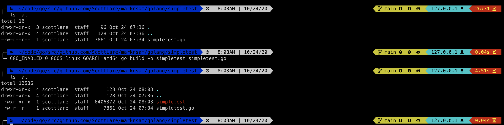

::: tip

Remember that it is required to have the GOOS=linux for docker images

:::


::: danger

If you run ./simpletest from your MAC, it will fail with the following error:

:::

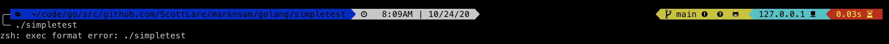


### Create a Dockerfile in the same directory as your code.

This step is composed of editing a Dockerfile and building that Dockerfile into a docker container that can be run locally via the **$ docker run** command.

Inorder to put our code into a docker image format, we will first create a Dockerfile in the same directory as our source code location. The Dockerfile is a simple text file with no extension.

#### Instruction

```
FROM scratch
COPY simpletest /
CMD ["/simpletest"]
EXPOSE 8080
```

::: tip

The FROM scratch allows docker to create a minimal container that is not copied from the docker hub or other initialized container that may have more layers than required.

COPY better than ADD

:::

<span style="font-size:20px;" ><b>`The difference between using ENTRYPOINT in my dockerfile and CMD?`</b></span> &#x1F53D;

| "What is the difference between CMD and ENTRYPOINT? You cannot override the ENTRYPOINT instruction by adding command-line parameters to the docker run command. By opting for this instruction, you imply that the container is specifically built for such use." [Docker Entrypoint ](https://phoenixnap.com/kb/docker-cmd-vs-entrypoint#:~:text=ENTRYPOINT%20is%20the%20other%20instruction,to%20the%20docker%20run%20command) |
| :--- |


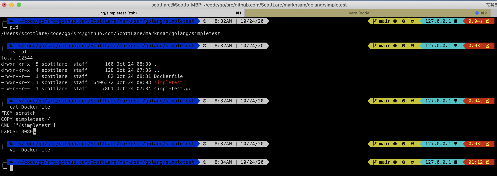


### Build your Dockerfile

In order to build your code into a docker image format, run the following command:

#### Instruction

```
$ docker build -t simpletest:v1.0.1 .
```

**Note** The -t parameter option lets us specify a name and a corresponding tag name. In this case, the image name will be simpletest and the tag will be v1.0.1

**Note** The "dot" or "period" in the above command is required..  This signifies that we are building to the current directory that we are in.

#### Instruction

```
$ docker images
```

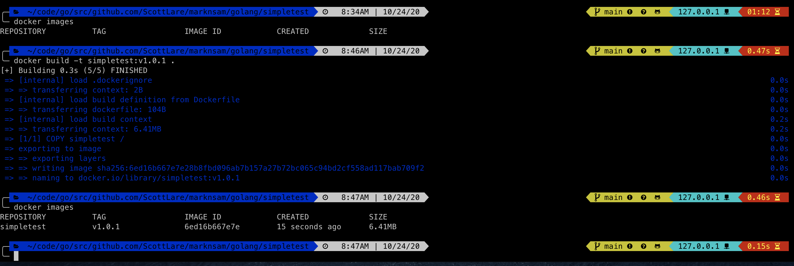

#### Tag names often used to display versions.

Note that in the above example, that we added, after the colon, the "tag" name.  In this example, we chose to give our image name the "tag" - "v1.0.1". Typically, we add version numbers as tags and they follow a convention like [semantic versioning](http://semver.org/).

### Run your docker container.

#### Instruction

```
$ docker run --rm -p 8080:8080 simpletest:v1.0.1
```

The result should be a "hanging cursor" as illustrated below.  This simply tells us that the golang webserver is running and waiting for requests on port 8080 inside our docker file.  The command also displays that our local desktop port 8080 is (-p) "published" to match with the docker container that is now running in a background process.

Since we are just compiling our application inside of the docker container we use the -rm flag because this flag combination removes the instance that you just created from the Docker Daemon and saves the disk space so that you don't have to clean it up later since docker makes a new image each time by using Copy On Write technology and adding your code changes with each new image creation to the top most layer (outter) of the the image.

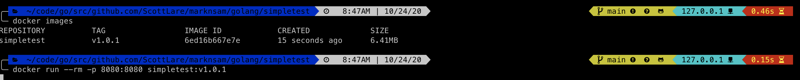

## Incorporating kubernetes

### Setup [MiniKube](https://kubernetes.io/docs/tutorials/hello-minikube/)

#### Install

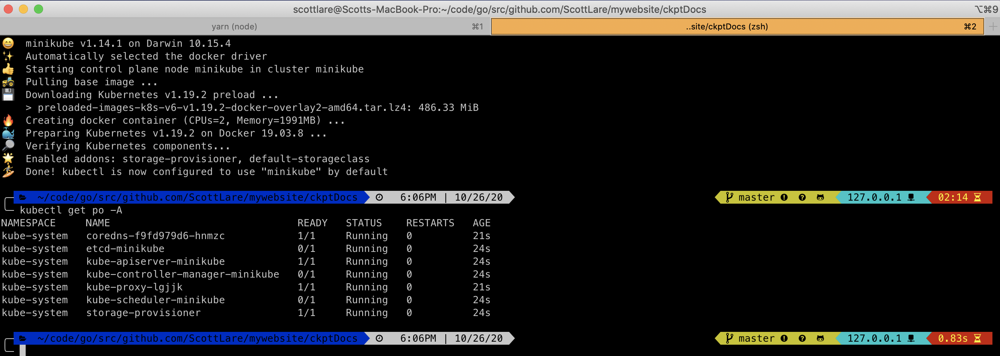


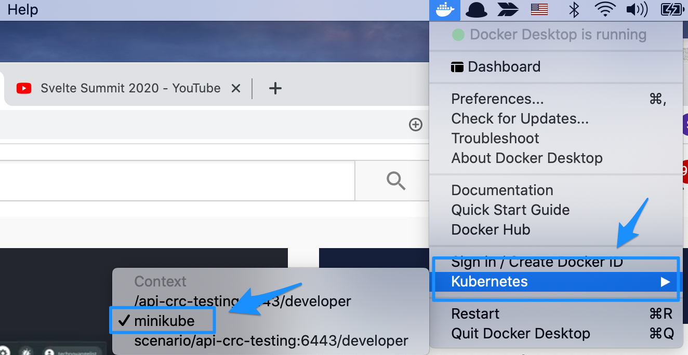

What does minikube do?  Basically, it just sets up a "one" node cluster so the only thing that it can really help us do locally is to test running an application on one node.  This can be helpful, but we will eventually want to have a local environment where more than one node exists.


### Install the [minikube dashboard](https://kubernetes.io/docs/tasks/access-application-cluster/web-ui-dashboard/)

#### Install

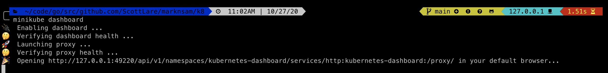

### Add a "development" [namespace](https://kubernetes.io/docs/concepts/overview/working-with-objects/namespaces/) to the miniKube Cluster

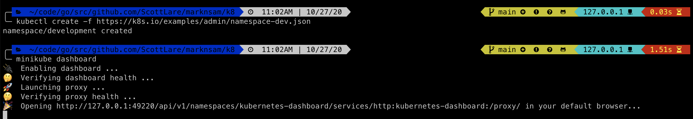

### Launch the [minikube dashboard](https://kubernetes.io/docs/tasks/access-application-cluster/web-ui-dashboard/)

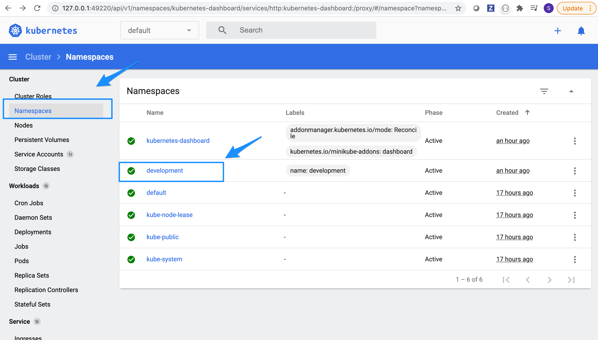

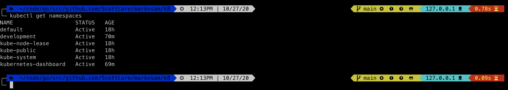

### [Setting the Namespace](https://kubernetes.io/docs/concepts/overview/working-with-objects/namespaces/#setting-the-namespace-preference) if you have multiple namespaces defined in your cluster.


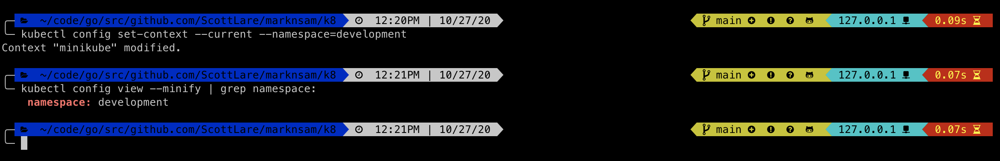


### Create a [pod](https://kubernetes.io/docs/concepts/workloads/pods/) in our "development" namespace.


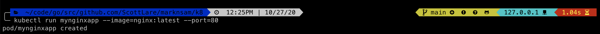


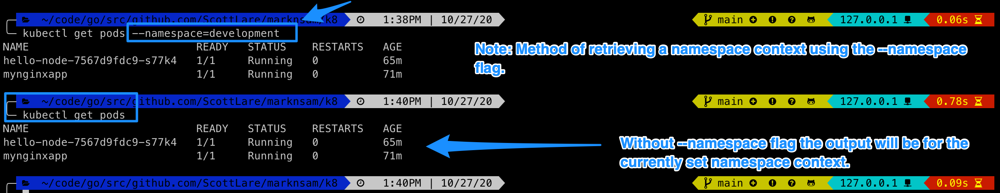

You can use the 

```bash
$ kubectl config view
```
to view the information in your config.

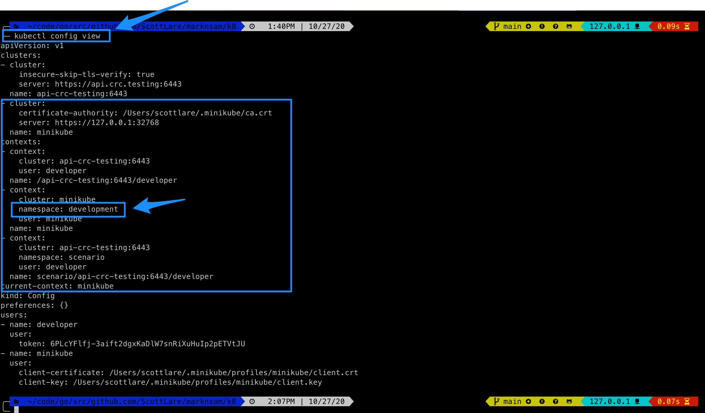

In addition to making sure that you set the config context to point to the correct namespace, also make certain to change to the correct namespace in the minikube dashboard.

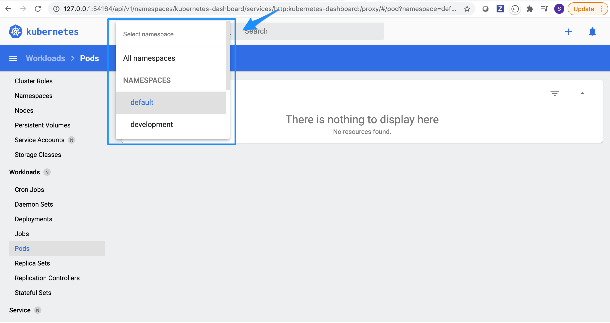

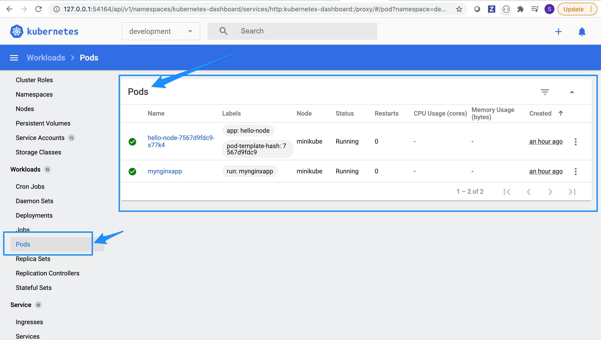

 
So far, using the Docker kubernetes environment or the minikube local environment I only get one node per cluster.  What if I want a local setup that more closely resembles a real world scenario and that offers more than one node per cluster.

### Add RancherOS K3d

::: tip NEW k3d for K8 local development cluster 

[K3d](https://k3d.io/)

[https://itnext.io/rancher-2-4-kubernetes-on-your-macos-laptop-with-docker-k3d-b578b1c7568b](https://itnext.io/rancher-2-4-kubernetes-on-your-macos-laptop-with-docker-k3d-b578b1c7568b)


[Kubernetes tooling for TechOps and Support](https://oteemo.com/2019/12/19/k8s-tooling-for-techops-support/)

:::

```bash
$ wget -q -O - https://raw.githubusercontent.com/rancher/k3d/main/install.sh | bash

```

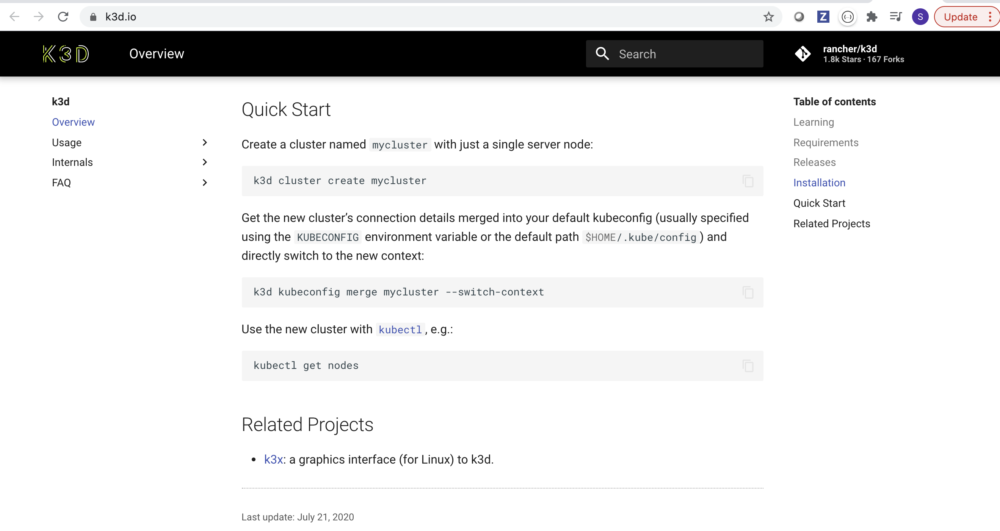

```bash
$ k3d cluster create mycluster
```

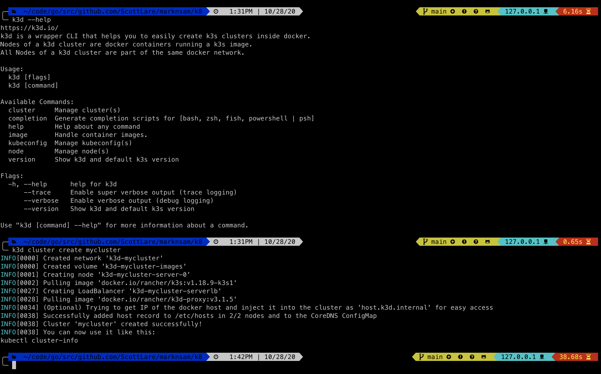

From Docs:

"Get the new cluster’s connection details merged into your default kubeconfig (usually specified using the KUBECONFIG environment variable or the default path $HOME/.kube/config) and directly switch to the new context:"

```bash
$ k3d kubeconfig merge mycluster --switch-context
```
"Use the new cluster with kubectl, e.g.:"

```bash
$ kubectl get nodes
```
:white_check_mark:

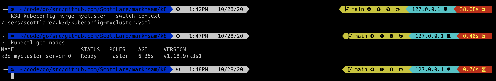


::: tip NEW

[Waypoint]() is a new Hashicorp open source product for the deployment option that I always wanted so I will test that out and describe its use as it offers a simple and powerful state-of-the-art publishing platform using HCL. 

Also, IBM purchased Red Hat.  I plan to stay free and "fully" open source moving forward, the [CoreOS container OS open source development](https://coreos.com/os/eol/) is being deprecated, so yesterday I researched and I am going to try out "Flatcars, Lokomotive K8s, Nebraska" to see if that will be my container OS of choice.  It began as a direct port of CoreOS, so that is very helpful in decision making process.

:::

### Add Fluentd for logs

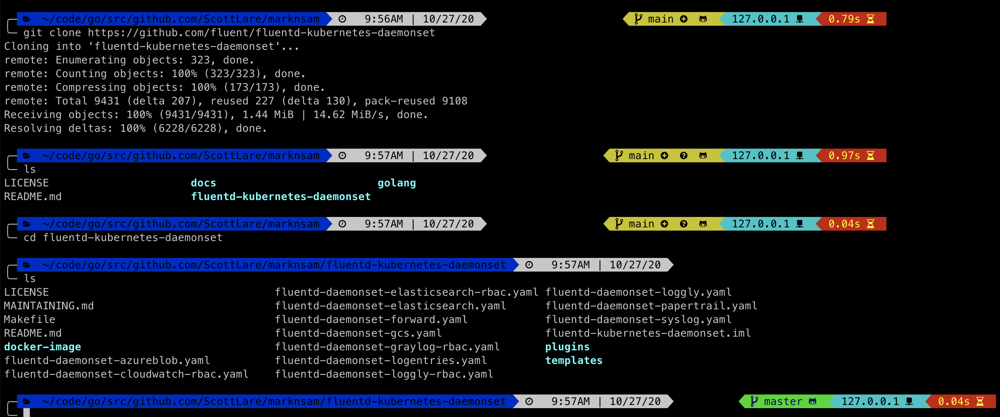

### Create Registry Token

### Create kubernetes Secret

### Publish Local Docker Image to Registry

### Create a Deployment YAML

#### Ingress

#### Deployment

#### Service
