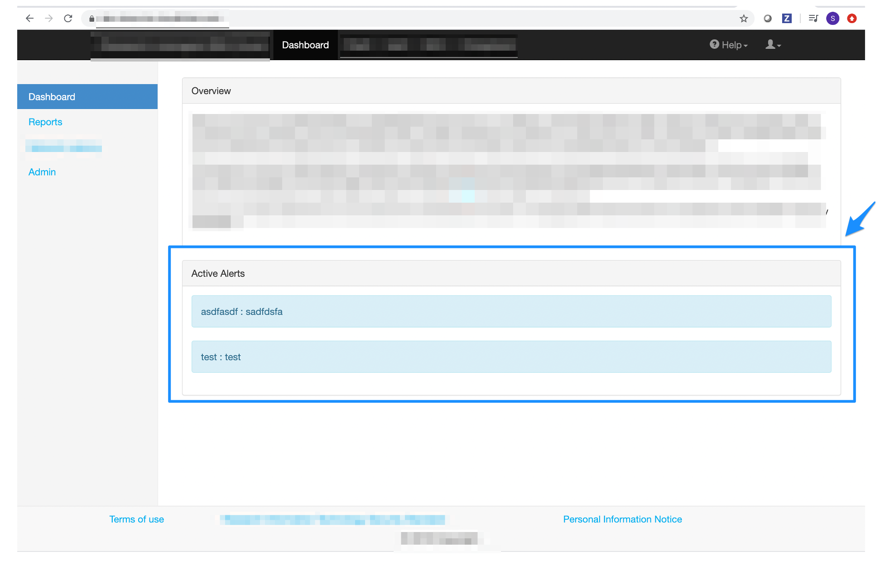
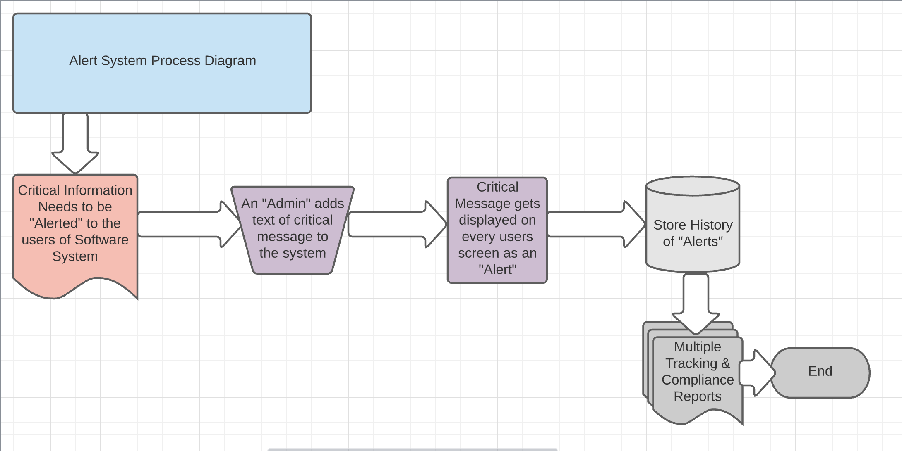
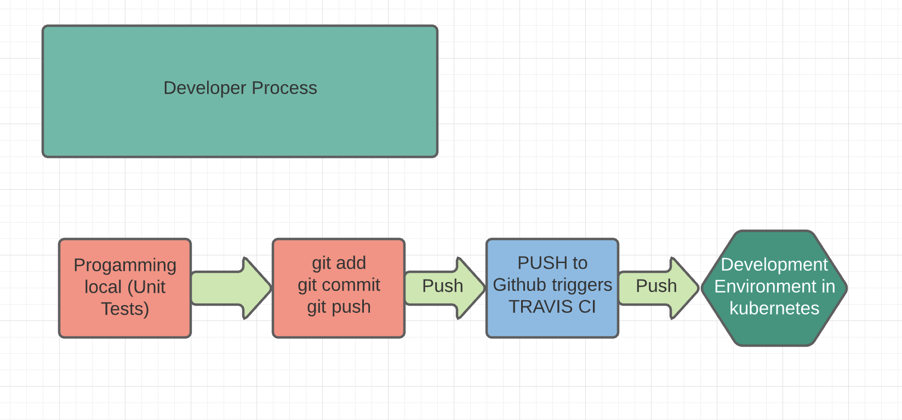
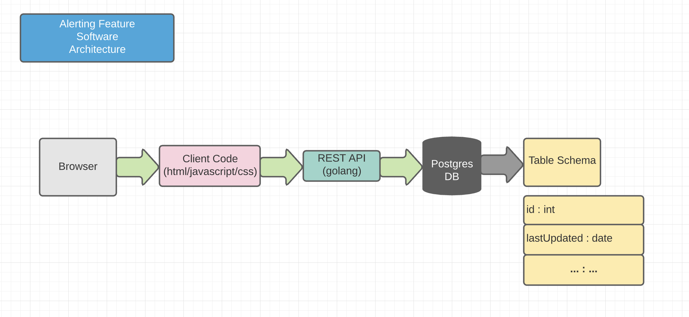
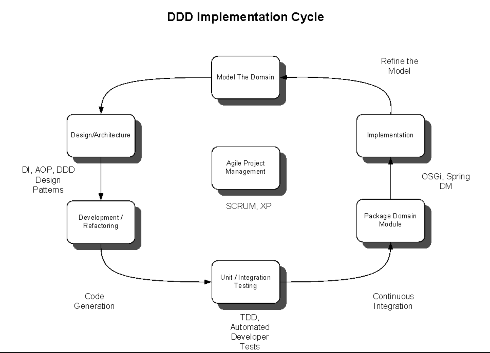
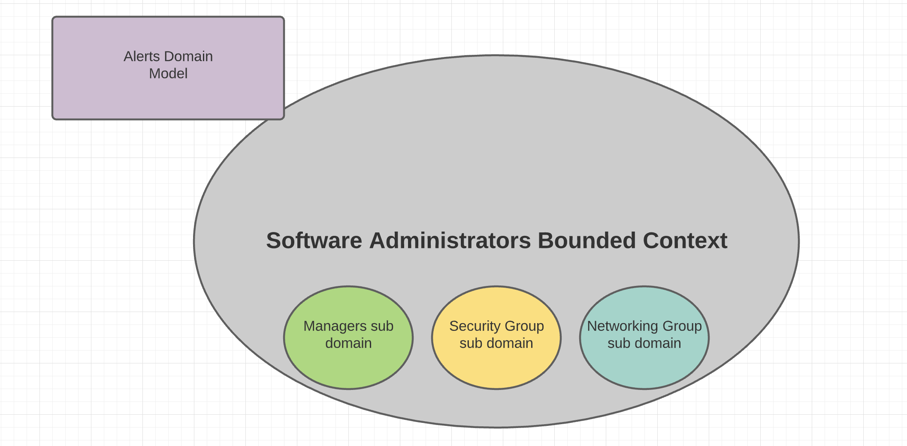
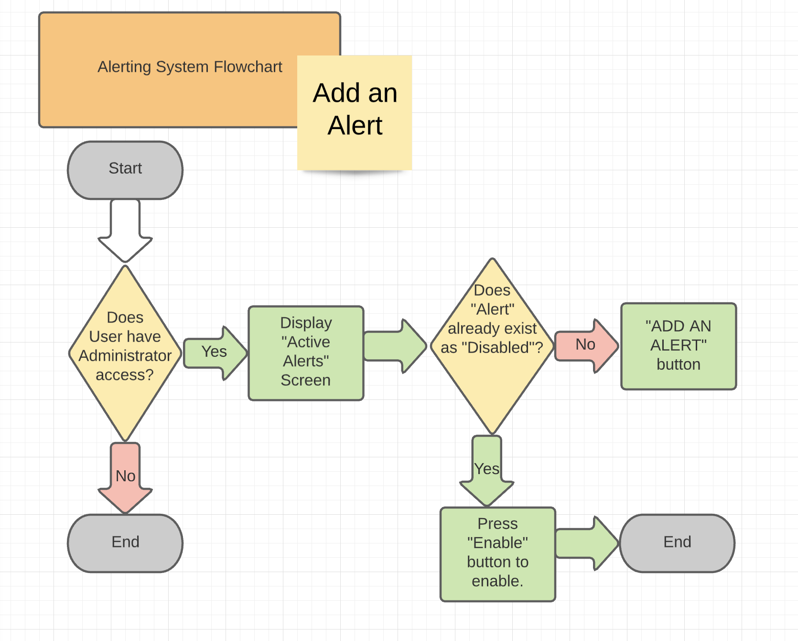
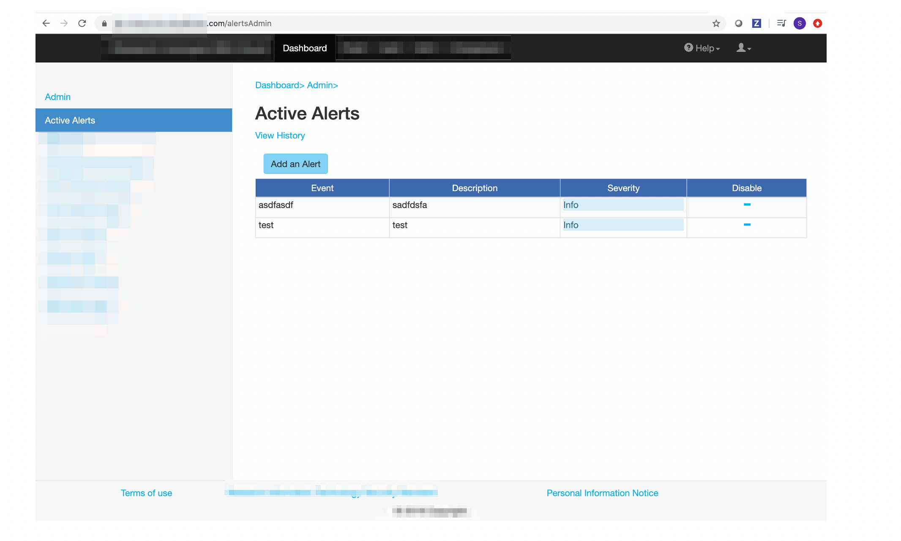
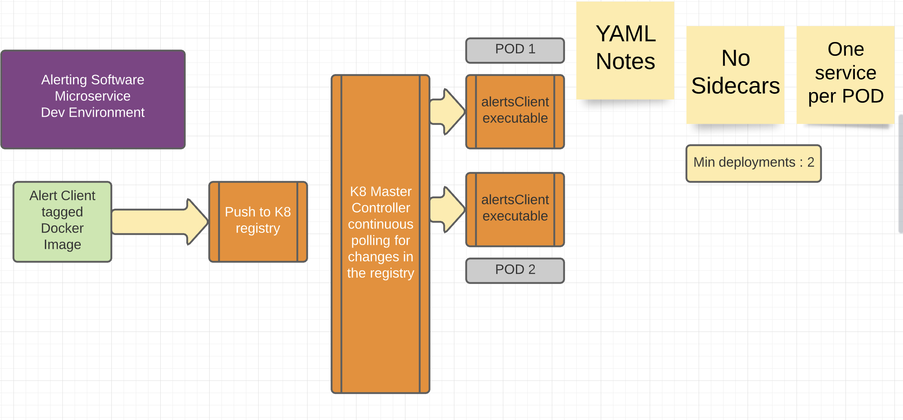
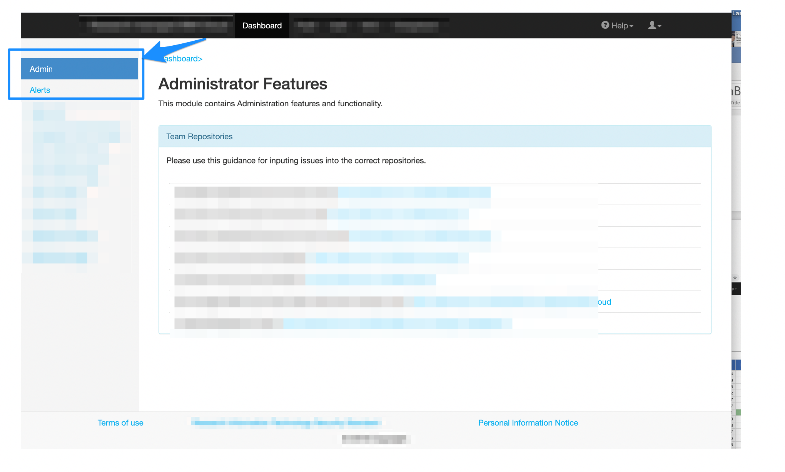

# Solidity

When a user first logs on, at the DASHBOARD display screen, if there are any current critical messages for the user, they should be displayed.

## Process Diagram

The process flow is illustrated below:

## The Developer Process

## General Architecture

## What is Domain Driven Software Architecture 

## Domain Model

## Add an Alert Flowchart

## Add an Alert Screen Shot

## Microservices

## The Administration Microservice

