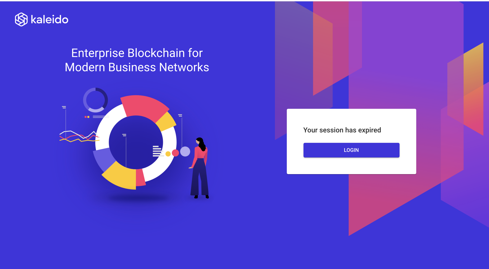

# Vid 1 Notes

Note that once logged in to Kaleido's free account that it will LOG YOU OUT after a certain amount of time if you are not active on it.

That time amount is:    ??

The limitations of using the free account vs a paid account are:

** Free Account : Only lasts 60 days from creation date.

[Kaleido Plans](https://docs.kaleido.io/using-kaleido/plans/)

The following limits allow us to offer this service for free:

60 days of active resource usage
1 centralized consortium
1 single region environment
2 non-signing small nodes
2 marketplace services (e.g. HD wallet, IPFS node, etc.)
5 application credentials
Limited node features (1 Node only)
Limited support
Intermittent failover resulting in brief resource unavailability
Automatic Pausing

[How to Resume a Paused Environment](https://docs.kaleido.io/faqs/why-is-my-environment-paused/)

[Kaleido Pricing](https://www.kaleido.io/pricing)

[Kaleido Pricing 2](https://www.kaleido.io/pricing#pricing-features)

