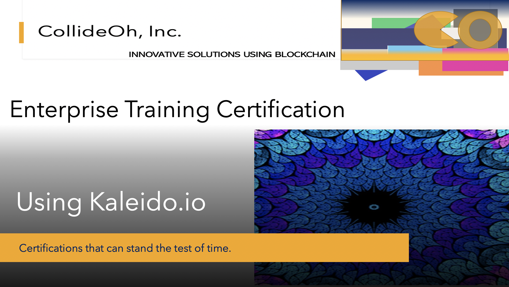
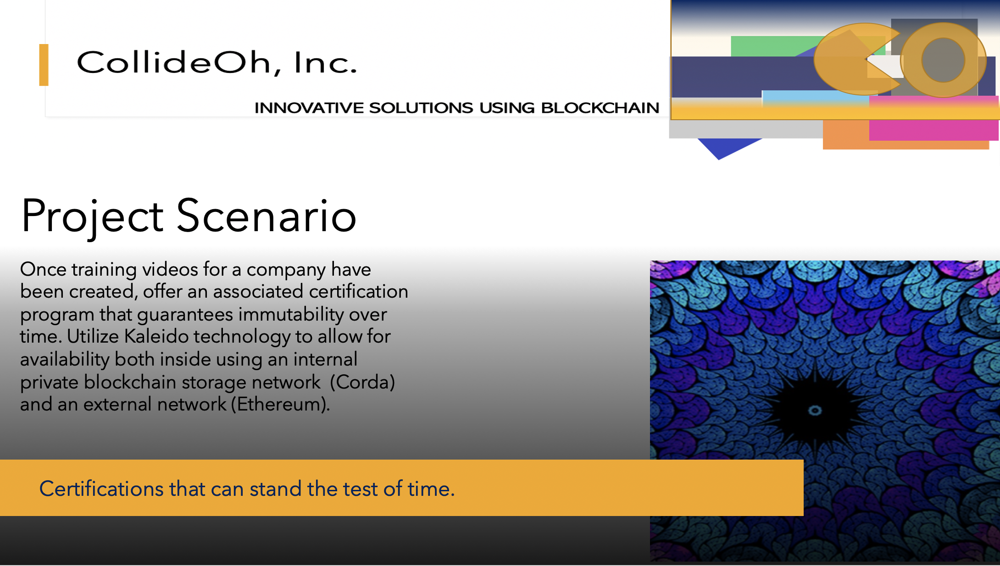
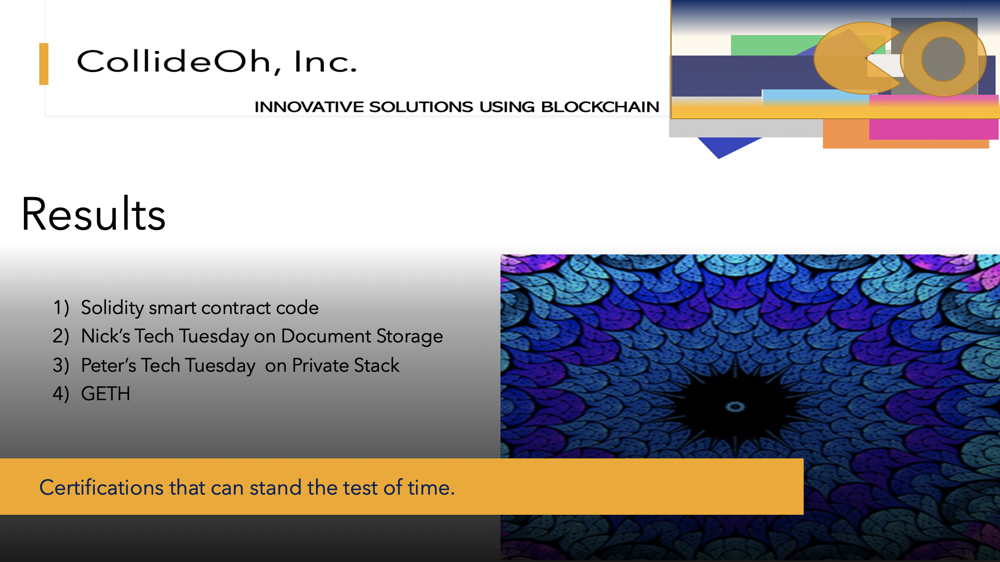

# Presentation 1

### Initial Thoughts:

This presentation describes and will outline a blockchain project idea. 

Other presentations may include a presentation on architecture and results depending on time alotted.

I choose this presentation format because I am familiar with using it and I find the workflow to be very efficient. The static site acts as an additional communication tool that can easily and quickly be used to demonstrate project progress, add value to project management as well act as a documentation source that is created "as the project progresses". 

The [static site generator](https://jamstack.org/generators/) I chose was "Vuepress" because I am already familiar. If I had more time to learn a different static generator I would choose HUGO simply because it is written in GO by SPF. I am bullish on the future of Golang when compared to using node.js.

> ## Slide 1 - Introduction

> ## Slide 2 - Project Scenario

> ## Slide 3 - Goals

> ## Slide 4 - Demo

