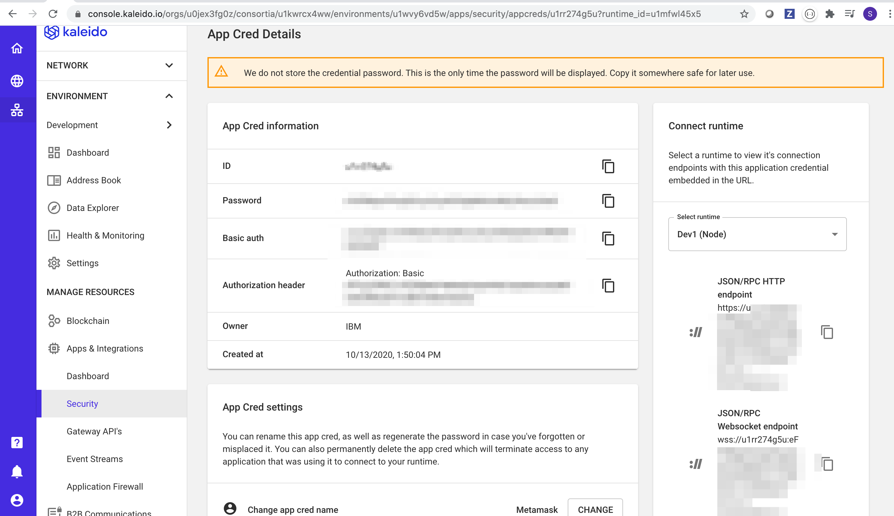
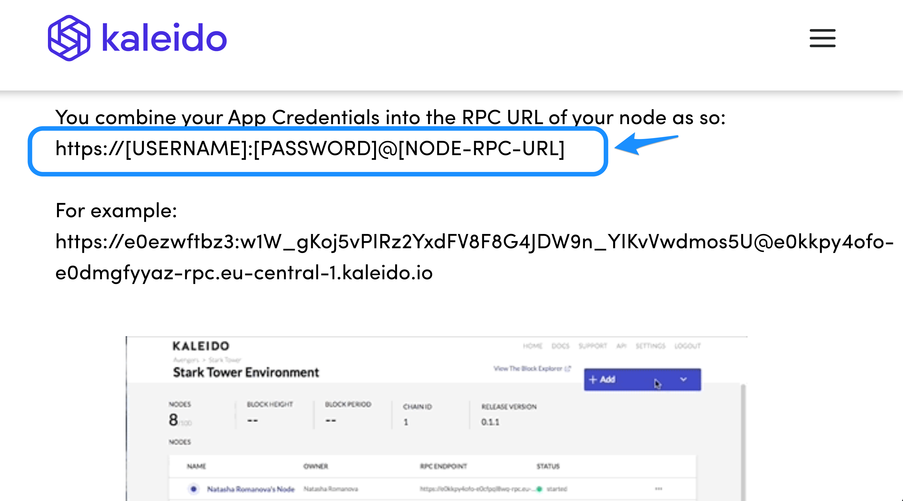
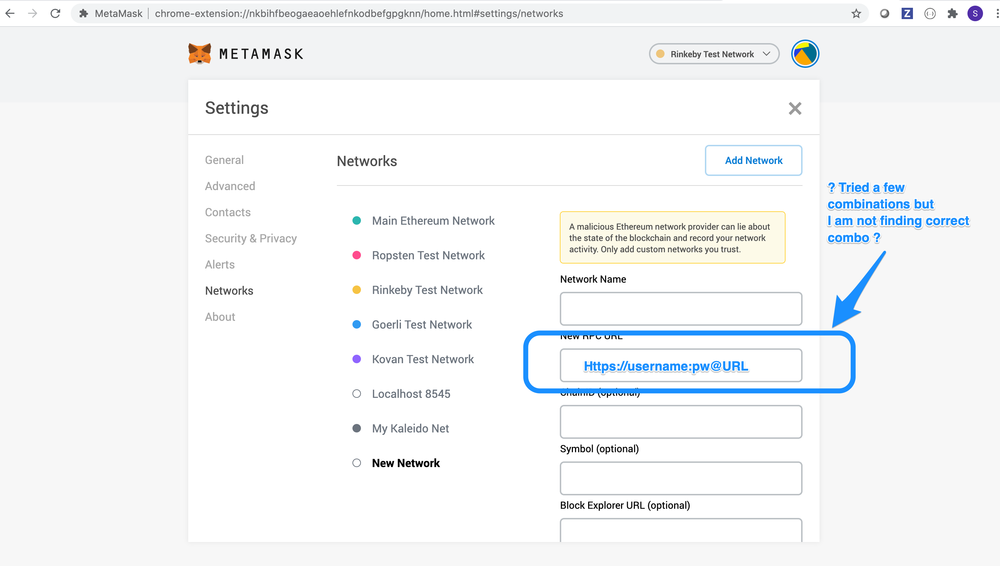
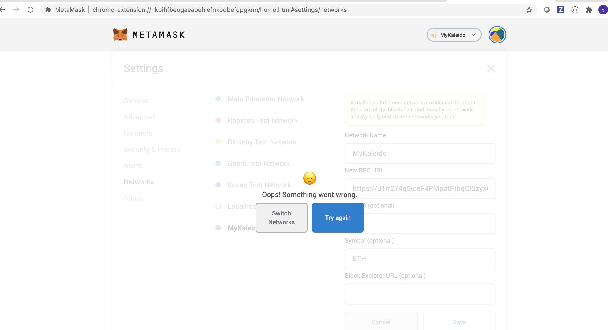

# Hooking up Remix to Kaleido?

Stumped: Which of the fields in the above illustration are used in the below screen to get Remix hooked up with Kaleido?

Metamask Input Prompt

Many thanks.

## Update:

I tried copy from right and get the below screen shot.

I will come back to it later. "I'm Probably missing a semi-colon somewhere" - burn't too much time already on it.

I can deploy "from source" or "github".  No worries, marching onward.