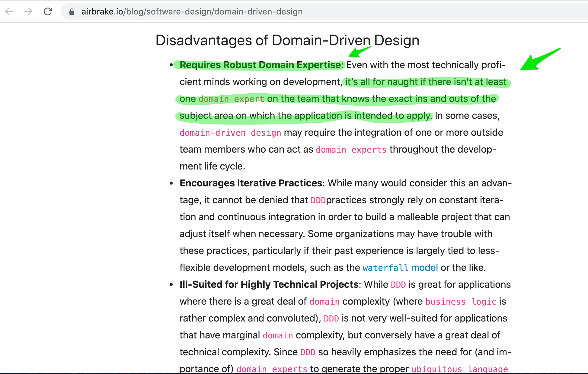
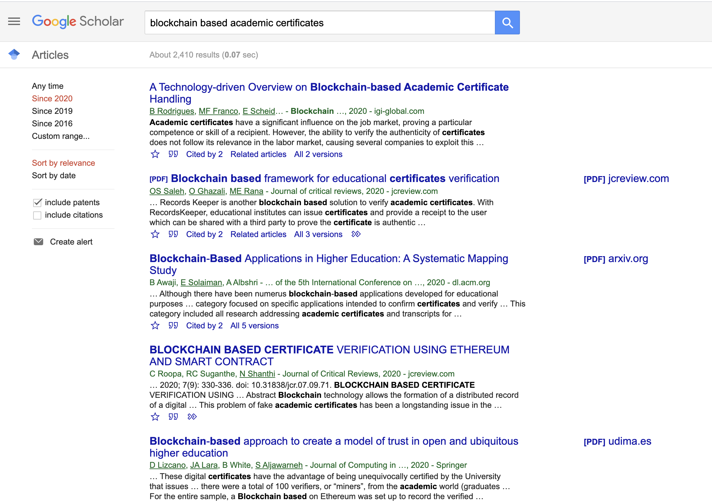
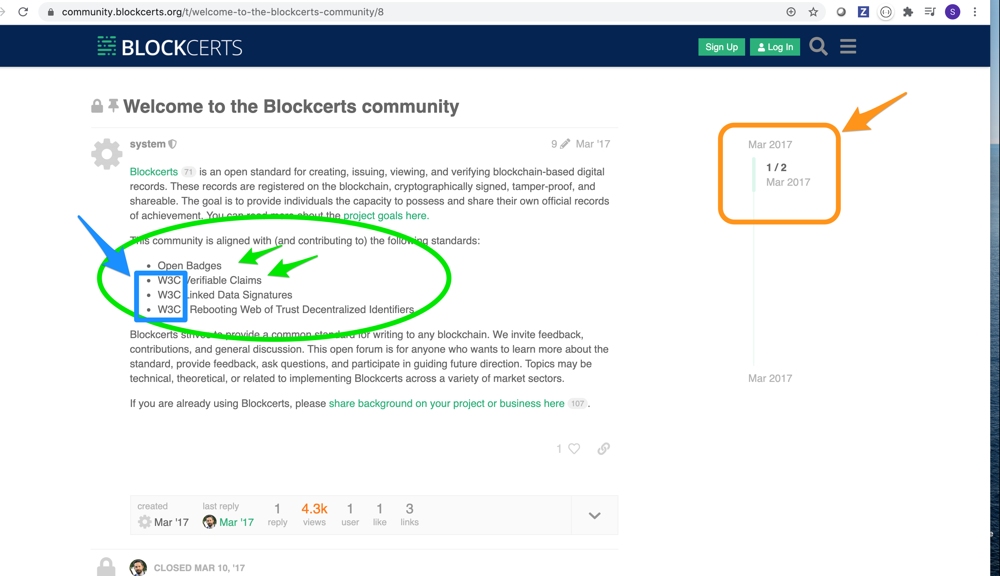
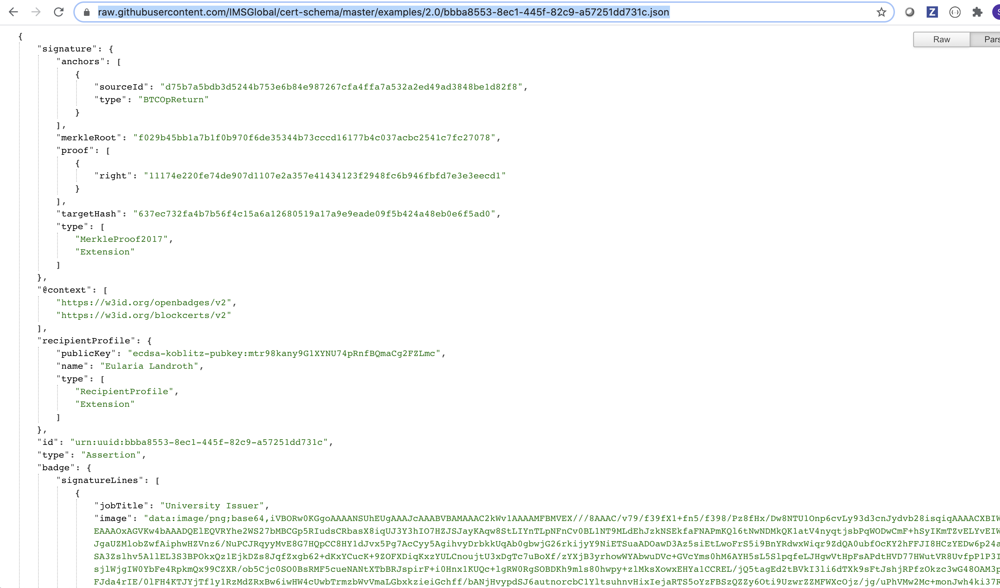
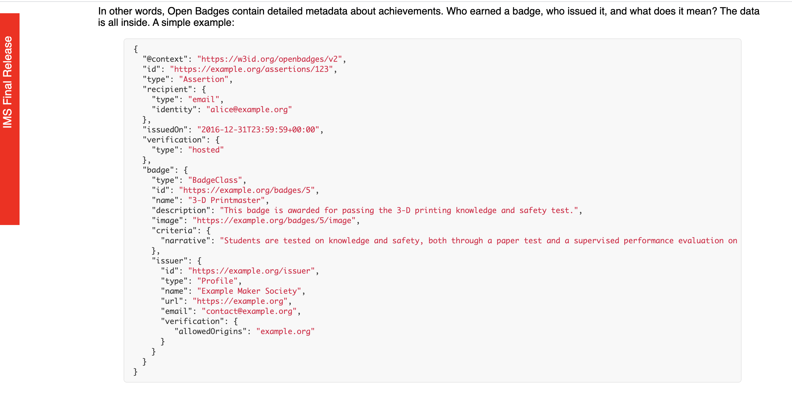

## Much more time needs to be spent here, but moving on.

In order to correctly identify the [Bounded Contexts](https://martinfowler.com/bliki/BoundedContext.html) for designing logical microservices, some amount of domain knowledge is necessary at the onset. 

[Domain-Driven Design – What is it and how do you use it?](https://airbrake.io/blog/software-design/domain-driven-design)

### Blockchain Certificates Domain Current State 

After researching I found the following interesting.

> MIT Work on BLOCKCERTS:

[What we learned from designing an academic certificates system on the blockchain MIT MEDIA LAB](https://medium.com/mit-media-lab/what-we-learned-from-designing-an-academic-certificates-system-on-the-blockchain-34ba5874f196#.p7gda76v4)

Blockcerts although Open Source, seems to have been adopted by a for profit software services company named [Hyland](https://www.hyland.com/en/platform/product-suite/hyland-credentials) 

Announcement concerning [Adoption of Blockcerts by Hyland](https://www.blockcerts.org/about.html)

[BlockCerts goals](https://community.blockcerts.org/t/blockcerts-goals/20)

[Welcome to BlockCerts Community](https://community.blockcerts.org/t/welcome-to-the-blockcerts-community/8)

[BlockCerts Community](https://community.blockcerts.org/)

#### Last Activity Date and W3 and (Badges vs. Certificates?)

#### The screen shot below demonstrates that their is an active community using blockCerts, but not overly active.

#### Also, W3?, of course, why not look there? 

:TODO BELOW
 

#### :question: Lastly, what is the difference between Badges and Certificates?  Check with team see what they may have to share.   

#### cert-schema: 

Have a chrome ext. like JSONViewer to identify fields structure from content if you choose to click on raw format below :smile:

[raw JSON data example](https://raw.githubusercontent.com/IMSGlobal/cert-schema/master/examples/2.0/bbba8553-8ec1-445f-82c9-a57251dd731c.json)

## Open Badges

After confirming with Jim - Open Badges it is!

High level Overview of domain space. Dated though: April 15th, 2015

[Ted Talk Overview Digital Badges](https://www.youtube.com/watch?v=DiTHIuqA0cc)

[What Are Open Badges?](https://badge.wiki/wiki/What_Are_Open_Badges%3F)

"The OBI allows any organization to build upon a secure yet open foundation. Potential badge issuers can be assured that the credentials they issue will be displayable anywhere on the web. Badge earners gain the advantage of being able to collect and curate their knowledge, skills, and experience from across the web in one place. And badge ‘consumers’can trust that the badges shown to them can be verified and trusted."

[Open Badges v2.0 IMS Final Release](https://www.imsglobal.org/sites/default/files/Badges/OBv2p0Final/index.html)

Fields derived from above OB common certification JSON file:

Organization is the top of the object tree. Organizations can issue certificates and Organizations can contain recipients of certificates, however, recipients do not need to be part of an organization or group.

> Table Name: Organizations

Groups could be departments, teams, or other types of groups that might exist inside the organization.

* Organization Name

> Table Name: Groups

> Table Name: Recipients

 | Field Name        | Description          |
| ------------- |:-------------|
| id | <a href="#step1a">ID for unique identification of the recipient of the certificate</a> |
| name | <a href="#step1b">Name of the Recipient</a> |
| email | <a href="#step1c">Email of the Recipient</a> |
| completedcourses | <a href="#step1d">Relational Key for list of courses attended</a> |
| badgerequests | <a href="#step1e">Who has requested and been sent a copy of the badge</a> |
| badgerequestmeta | <a href="#step1f">Relational key to additional information provided by the badge requestor</a> |
| issuermeta | <a href="#step1g">Relational key to additional information from issuer</a> |

> Table Name: Certificates

 | Field Name        | Description          |
| ------------- |:-------------|
| id | <a href="#step2a">ID for unique identification of the certificate</a> |
| type | <a href="#step2b">List of supported environmental variables</a> |
| name | <a href="#step2c">Example configuration file</a> |
| description | <a href="#step2d">More to come!</a> |
| image | <a href="#step2e">More to come!</a> |
| criteria | <a href="#step2f">More to come!</a> |

> Table Name: Issuers

 | Field Name        | Description          |
| ------------- |:-------------|
| id | <a href="#step3a">ID for unique identification of the Issuer</a> |
| orgid | <a href="#step3b">Relational key to ID for unique identification of the organization</a> |
| TBD | <a href="#step3c">More to come!</a> |
| TBD | <a href="#step3d">More to come!</a> |

> Table Name: Badges

 | Field Name        | Description          |
| ------------- |:-------------|
| TBD | <a href="#step4a">More to come!</a> |
| TBD | <a href="#step4b">More to come!</a> |
| TBD | <a href="#step4c">More to come!</a> |
| TBD | <a href="#step4e">More to come!</a> |

 
:TODO

1. Create the SQL Test DATA

 1. Add an Organization Screen
 2. Add an Organization as an Issuer

 
 