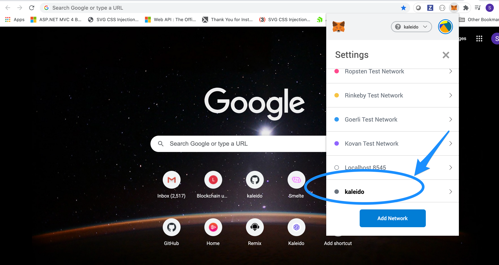
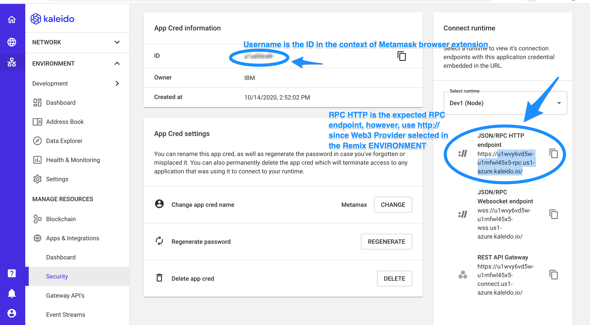
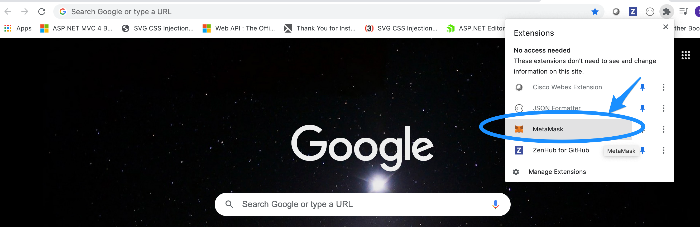
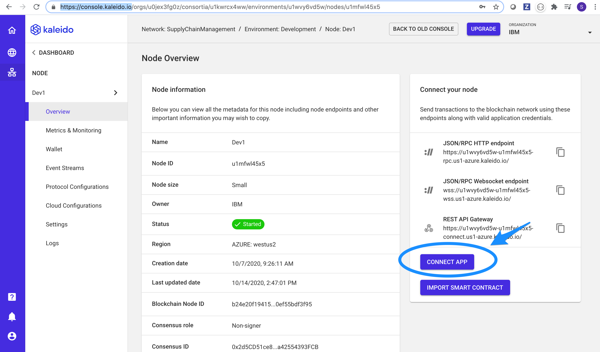
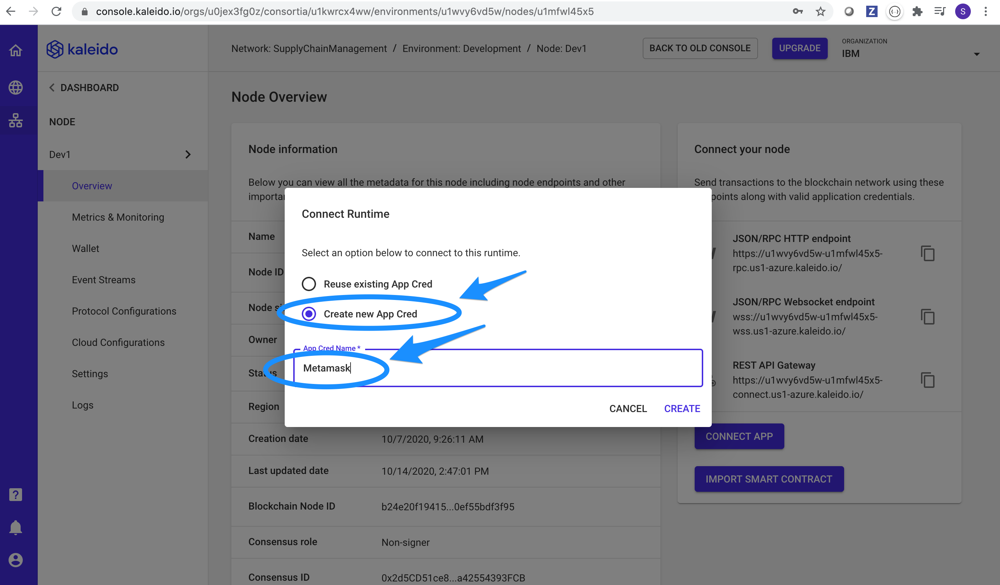
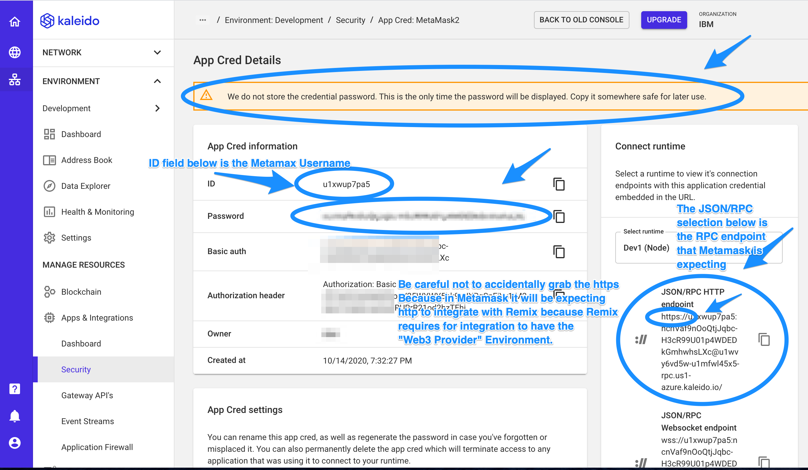
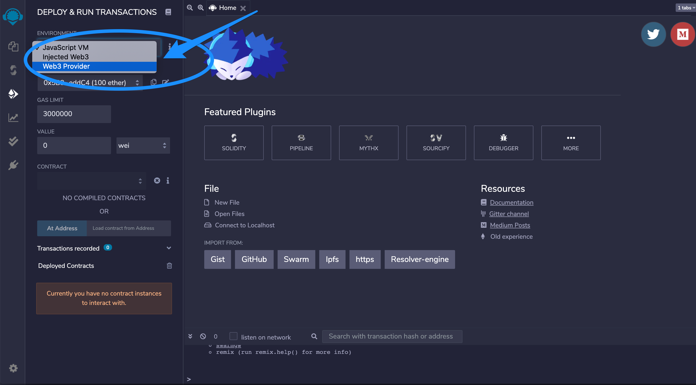
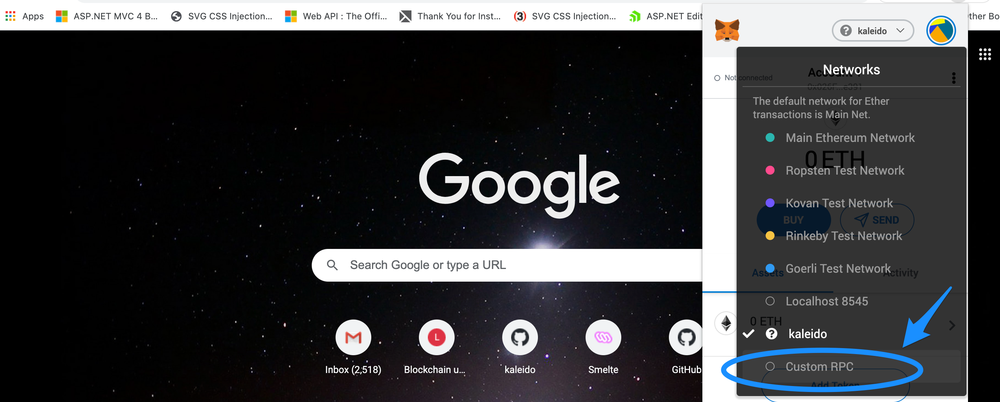
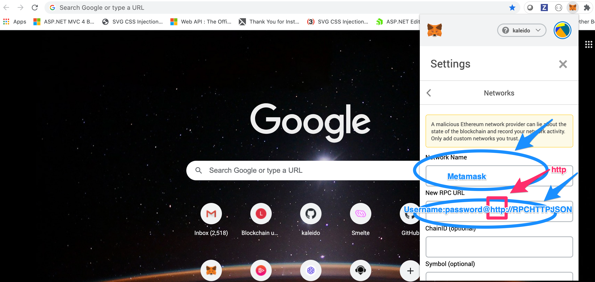

# Remix - Metamask - Kaleido Notes

#### Goal:

#### How to setup:

#### The [ username : password @ RPCEndpoint ] for Metamask

#### Hook up to kaleido

1. [First download and install the Chrome Browser Extention](https://metamask.io/)

2. Next, you need to login and then create an Application Credential inside of the Kaleido framework. 

[kaleido.io](https://console.kaleido.io/)

To create the Application Credential select your node that you want to interface Remix onto and then select the "Connect App" button and enter a name for the App Credential.  In this case, I used the name "Metamask", but use any name that is easiest to remember.

3. Next, Note that in this screen shot below, that you need to copy this password somewhere safe or you won't get it back again.  But, you can of course, delete it and re-create a new one at any time.

The password is going to be the password that you need to put into the second parameter required in the following RPC request

The format is Username : Password @http://

Note two things initally about the format above.  First, when connecting with Remix, you will have to set the environment to "Web3 Provider" inside of ReMix (demonstrated in a bit), and this means that the RPC or 3rd parameter must begin with http after the @ sign and not https.

Also, the username that is asked for here, is called the ID on the Kaleido.io App Credentials page. See illustration below:

When using Remix with Kaleido and Metamask, make sure to select the "Web3 Provider" Environment option as illustrated below.

Heeding back to the Metamask browser extension, click on the Metamax Fox extension and then select the "Custom RPC" radio button as illustrated below.

Lastly, in the below screen shot, you only need to fill out the "Network Name" field with "Metamask" or whatever name you come up with and the "New RPC URL" which must be in the following format:

username:password@http://RPCEnpoint

**Note** that it is http above, be careful not to just copy and paste from the kaleido frameword without changing from "https" to "http".

Also, the RPCEndpoint is the top most one from the 3 listed in the Kaleido framework, and the username is listed as the id and is located with the password for App Credentials which you need to create by selecting the "Connect App" button on the Kaleido user interface and then selecting the radio button for creating a new connection.

#### Metamask Resources

[Creating a Custom RPC connection](https://docs.kaleido.io/developers/smart-contracts/metamask/)